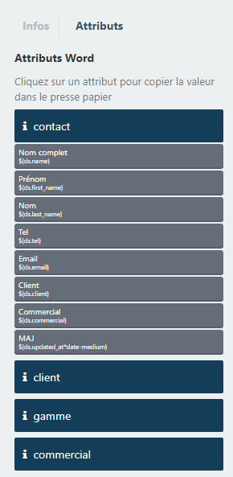

# Data Source
Ces classes ne fonctioneront que dans un plugin winter.cms voir ( mais non verifié ) sous october.cms
## Qu'est ce que le module Data Source
Le module DataSource permet de relier entre eux vos modèles de déclarer les relations, des controlleurs des mapping pour le cloud et pleins d'autres choses. 

C'est notamment via les DataSource que nous affichons dans la colonne attributs les relations disponibles dans un modèle de production



## Comment configurer un DataSource
1. Ajouter cette ligne dans la fonction boot d'un plugin winter.cms
```php
\DataSources::registerDataSources(plugins_path().'/{auteur}/{plugin}/config/datasources.yaml');
```
2. Créer un fichier datasources.yaml dans le repertoire Config du plugin. pour chaque ressource voici les champs disponibles : 
```yaml
datasource:

    #Exemple pour une ressource issue du modèle : \Auteur\MonPLugin\Ressource1
    ressource1: 
        label: Ressource 1
        code : ressource1
        author: Auteur
        plugin: MonPLugin
        name : Ressource1

    autreRessource:
        label ...
        ...

    autreRessource:
        label: ...
        ...
```

## Utilisation du DataSource
DataSource embarque deux classes : 
```php
\DataSources::class
//regroupe des méthodes sur l'ensemble des datasources
\Datasource::class
//regroupe des méthodes pour une datasource
```
### Les méthodes DataSources
```php
//Permet d'instancier un datasource via son code. retourne le datasource instancié
Datasources::find($codeDuDatasource)

//Permet d'instancier un datasource via sa classe. retourne le datasource instancié
Datasources::findByClass($class)

DataSources::registerDataSources($data);
DataSources::list($filter);
DataSources::getLabel($code)
```
### Les méthodes DataSource
```php
//instancie un modèle du dataSource via son ID
Datasource->getQuery($modelId = null) : 

/**
 * Liste les modèles d'un producteur disponible. 
 * $productorModel :: la classe du producteur
 * $modelId :: le modèle qui va envoyer des données
 **/
Datasource->getProductorOptions($productorModel, $modelId = null)


//Pour mémoire les autres fonctions
Datasource->getLotProductorOptions($productorModel, $modelId = null)
Datasource->getPartialIndexOptions($productorModel, $modelId = null)
Datasource->getScopesLists()
Datasource->getScopeOptions()
Datasource->getFullQuery($modelId = null) 
Datasource->listRelation()
Datasource->getValues($modelId = null, $withInde = true)
Datasource->getWorkflowState()
Datasource->getStateLogsValues($modelId = null)
Datasource->getContact($type, $modelId = null)
Datasource->getSrcImage()
Datasource->getImagesFilesFrom($type, $code = null)
Datasource->getPublicationsType()
Datasource->getPublicationsTypeLabel($key)
Datasource->getPublicationsFromType($class)
Datasource->getAttributesConfig()
```

### Extention de fonctions de Datasource
```php
//Exemple 
 \Waka\Utils\Classes\Ds\DataSource::extend(function($ds) {
    $ds->addDynamicMethod('getImagesFilesFromMontage', function($code) use ($ds) {
        $code ? $code : $ds->code;
        return \Waka\Cloudis\Models\Montage::whereHas('waka_session', function($q) use($code) {
                    $q->where('data_source', $code);
        })->lists('name', 'id');
    });
        
});
```