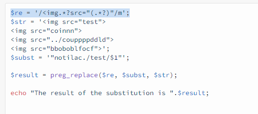

# Installation
Pour l'installation de l'application, veuillez suivre les recomendation de [winter.cms](https://wintercms.com/docs/setup/installation). Les recomendations sur le serveur à utiliser sont les mêmes. 



## Installation du repo et des librairies
Plus spécifiquement : 
1. Préparez votre fichier .env, c'est le fichier qui va recevoir tous vos codes. ( des sous modules peuvent exiger de nouvelles variables, veuillez vous referez au docs spécifiques de chaque module) 
1. Clonez votre repo ou ouvrez le fichier zip qui vous à été fournis
1. executez les commande suivantes dans votre terminal  pour installer et mettre à jours vos sous modules
```
git submodule init
git submodule update
```
4. Mettre à jours et ou instaler les librairies
```
composer install
```
5. Effectuez la migration ou simplement mettre à jour les tables
```
php artisan queue:restart
```
6. Mirroring (vous devez choisir un répertoire publice ex: public dans le parametrage de votre serveur)
```
php artisan winter:mirror public
```
