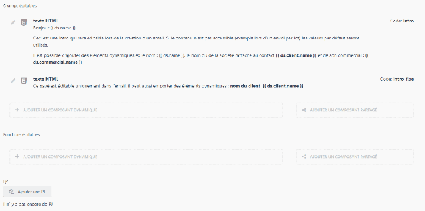

# Les composants dynamiques (ou subform)
Les outils de production et vos modèles de données peuvent être complétés avec des sous modèles :  ASKS, FNCS, CONDITIONS, CONTENTS, etc.

Prenons l'exemple d'un email, il dispose dans son modèle de champs comme le titre, le contenu, des options au format JSON, etc. Il dispose aussi d'ASKS, de FNCS, et de conditions. Cette page explique le fonctionnement de ces derniers. 

Un subform peut être considéré comme un ensemble MVC relié à un modèle parent. 
1. Il a son propre modèle 
2. Il a un ou plusieurs contrôleurs associés
3. il a sa propre base.

Le gros avantage est de pouvoir étendre les possibilités d'éditions sans toucher au modèle d'origine. 
Par exemple pour le modèle wakaMail, j'ajoute des possibilités d'éditions grâce aux asks et fnc pour chaque projet sans avoir à étendre ou à modifier le fonctionnement du modèle de base wakaMail. 


## les 5 types de SubForm
Ils sont tous polymorphiques, ils ont tous la même racine même si les usages des différents subform n'ont rien à voir. 


|Libellé du subForm|relation à utiliser*|Class|Appel dans Twig|utilisation|
| --- | --- | --- | --- | ---
|ask|rule_asks|Waka\Utils\Models\RuleAsk|{{ asks.codeDuHeader}}|Permets de déclarer un nouveau  champs et de l'intégrer dans une fusion en passant par Twig, il est en outre possible de préciser si l'information doit être modifiée avant la fusion.
|fnc|rule_fncs|Waka\Utils\Models\RuleFnc| {{ fncs.codeDuHeader}}| Permets de déclarer une relation enfants et d'effectuer une requête dessus. La souplesse des formulaires associée permet d'affiner au maximum la requête avant la fusion.
|condition|rule_conditions|Waka\Utils\Models\RuleCondition| - | On se sert exclusivement du subform condition pour définir des rèles d'éligibilité à un document dynamique. 
|bloc|rule_blocs|Waka\Utils\Models\RuleBloc | - | Permets d'ajouter d'autres blocs de contenu. Utilisé notamment dans wakamail pour fusionner des blocs de contenus avec Bracket. 
|content|rule_contents|Waka\Utils\Models\RuleContent | - |Permets de déclarer du contenu pour des pages web.


Exemple de déclaration dans un modèle

```php
// ..Model 
public $morphMany = [
    'rule_asks' => [
        'Waka\Utils\Models\RuleAsk',
        'name' => 'askeable',
        'delete' => true
    ],
    'rule_fncs' => [
        'Waka\Utils\Models\RuleFnc',
        'name' => 'fnceable',
        'delete' => true
    ],
    'rule_conditions' => [
        'Waka\Utils\Models\RuleCondition',
        'name' => 'conditioneable',
        'delete' => true
    ],
    'rule_blocs' => [
        'Waka\Utils\Models\RuleBloc',
        'name' => 'bloceable',
        'delete' => true
    ],
];
```

## SubForm et le FormWidget ruleBuilder
Les SubForm ne fonctionnent qu'avec le formWidget rulebuilder. Sans eux ils sont inutiles. 

Exemple de subform ( ici il y en a deux :  un pour ask l'autre pour fnc)



Les déclarations  d'un rule builder:
|code|fonction|
|---|---|
|targetProductor|Spécifie quelle est la cible. En fonction de cette valeur, nous allons filtrer les possibilités de subform. ex: le subform chartopenXml qui permet de créer des graphiques PowerPoint ne fonctionne que pour le producteur: presentation. il n'apparait pas si le targetProductor est wakaMail. 
|ruleMode| Permets de préciser le type de ruleAsk que nous travaillons (ask, fnc, content, condition, )


Exempled de déclaration dans fields.yaml d'un modèle : 
```yaml
froms: 
    fields :
        #...

        #...
    rule_asks:
        label: waka.mailer::wakamail.rule_asks
        span: full
        type: rulebuilder
        targetProductor: wakaMail 
        full_access: waka.rules.asks.admin
        ruleMode: ask
        showAttributes: true
        permissions: [waka.rules.asks.*]
        tab: waka.mailer::wakamail.tab_edit
    rule_fncs:
        label: waka.mailer::wakamail.rule_fncs
        span: full
        type: rulebuilder
        targetProductor: wakaMail
        full_access: waka.rules.fncs.admin
        ruleMode: fnc
        permissions: [waka.rules.fncs.*]
        tab: waka.mailer::wakamail.tab_edit
```